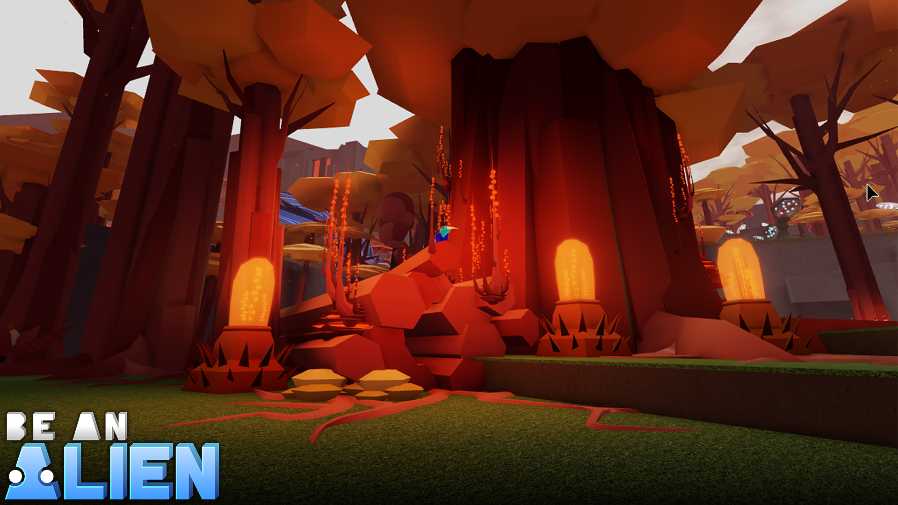

Welcome to **The Kiray Archive**: a lore-book about the alien moon [[Kiray]], the lifeforms that inhabit it, and the rise and fall of the advanced civilization it once hosted.

This is a hard sci-fi worldbuilding project backing the Roblox game [Be an Alien: Renewal](https://www.roblox.com/games/463915360/Be-an-Alien-Renewal), which is a Roblox game about becoming an alien creature on the moon [[Kiray]] of the Skyris system, and roleplaying, exploring, fighting, and building as that creature. Become one of many custom alien creatures that look like snakes, birds, lizards, dinosaurs, and other weird things, and customize your character. 

If you are a Roblox player on Discord, you can [join the community](https://discord.gg/xnrm338P7N) to learn more, or even contribute. Currently, lore for this project is a work in progress, and many details are not defined at all, feel free to participate in speculation about species, ecosystem, astronomy, civilization, etc. Your ideas may shape the future of this project. 

## Browse the Archive

- **[[World/index|World]]** — Broad information about [[Kiray]], its parent gas giant Kete, and the Skyris system.
- **[[Creatures/index|Creatures]]** — The species of Kiray and beyond, from the sapient [[Skiedon]] to the humble [[Tinit|Tinit]].
- **[[Civilization/index|Civilization]]** — Details about [[An_Overview_of_Skiedonic_Civilization|Skiedonic civilization]] and way of life.
- **[[History/index|History]]** — Records of key events, including [[The_Fall_of_Civilization|the Fall of Civilization]]